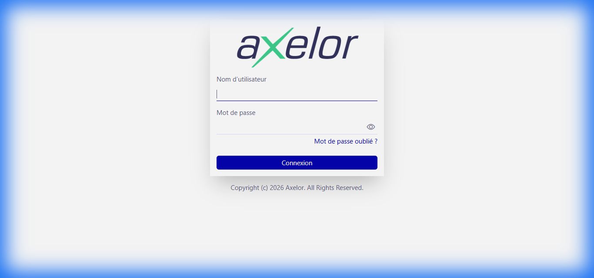
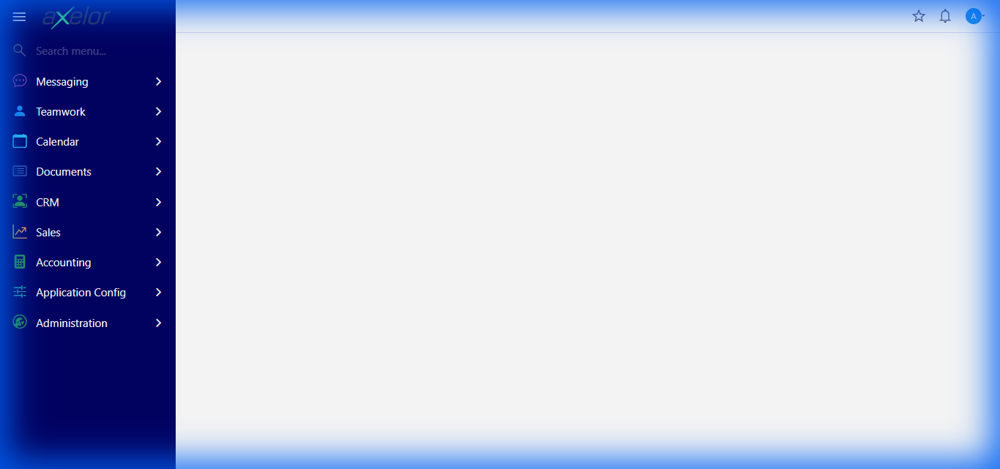
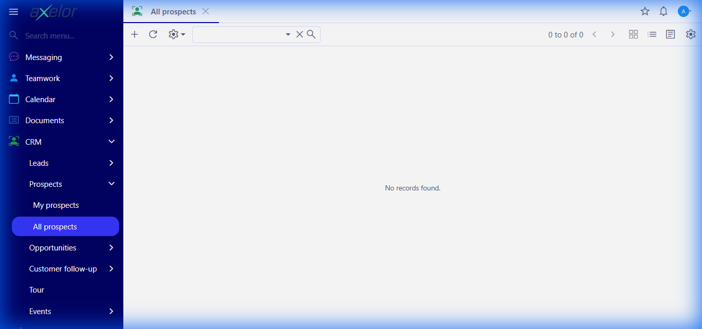
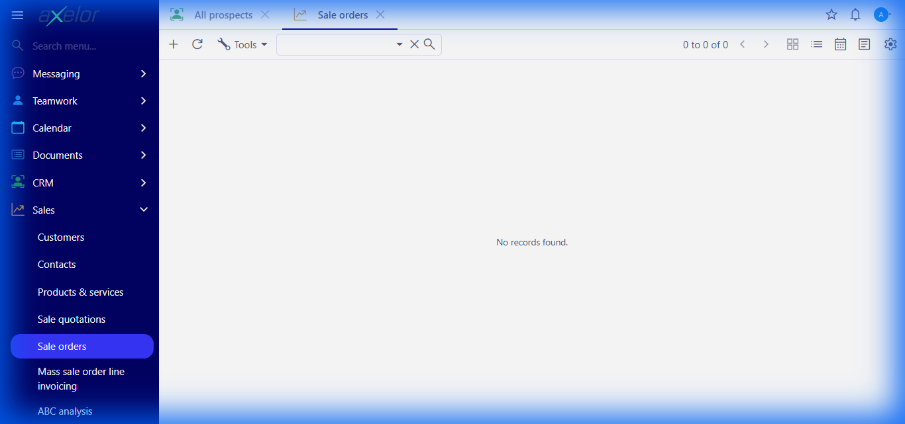
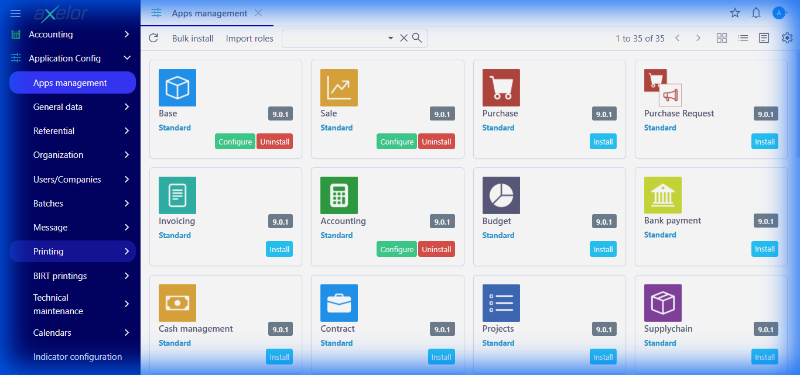

Axelor Open Suite
================================

Axelor Open Suite reduces the complexity and improve responsiveness of business processes. Thanks to its modularity, you can start with few features and  then activate other modules when needed.

Axelor Open Suite includes the following modules :

* Customer Relationship Management
* Sales management
* Financial and cost management
* Human Resource Management
* Project Management
* Inventory and Supply Chain Management
* Production Management
* Multi-company, multi-currency and multi-lingual

Axelor Open Suite is built on top of [Axelor Open Platform](https://github.com/axelor/axelor-open-platform)


Screenshots
================================

### Login Page


### Dashboard


### CRM - Contacts


### Sales - Orders


Prerequisites
================================
*   [Docker Desktop](https://www.docker.com/products/docker-desktop/) installed.
*   Git installed.

Running with Docker
================================

The easiest way to run the application is using Docker Compose.

1.  **Start the application:**
    ```bash
    docker-compose up -d
    ```
    This will start the PostgreSQL database and the Axelor application.

2.  **Access the application:**
    Open your browser and navigate to [http://localhost:8080](http://localhost:8080).

3.  **Default Credentials:**
    *   **Username:** `admin`
    *   **Password:** `admin`

4.  **Stop the application:**
    ```bash
    docker-compose down
    ```

How to Install Modules
================================
Axelor Open Suite is modular. You can install additional modules directly from the interface.

1.  Log in as **Administrator**.
2.  Navigate to **Application Config** -> **Apps management** in the side menu.
3.  Find the module you wish to install in the list.
4.  Click the **Install** button next to the module.

### Module Installation Screen


installation
================================

To compile and run from source, you will need to clone Axelor Open Suite modules, which is a
[git submodule](https://git-scm.com/book/en/v2/Git-Tools-Submodules) repository, using following commands:

```bash
$ git clone git@github.com:axelor/open-suite-webapp.git
$ cd open-suite-webapp
$ git checkout master
$ git submodule init
$ git submodule update
$ git submodule foreach git checkout master
$ git submodule foreach git pull origin master
```

You can find more detailed [installation instructions](https://docs.axelor.com/abs/5.0/install/index.html) on our documentation.
